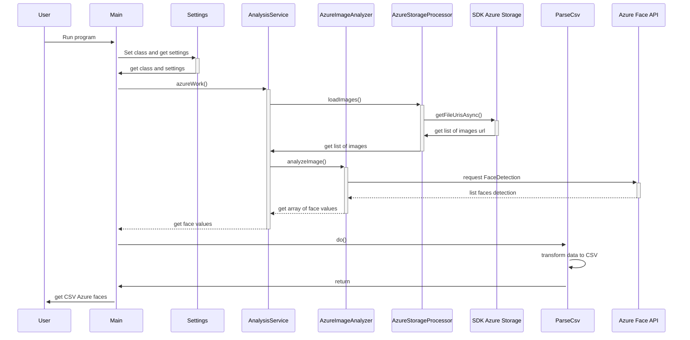

```mermaid
sequenceDiagram
    participant U as User
    participant M as Main
    participant S as Settings
    participant AS as AnalysisService
    participant AIA as AzureImageAnalyzer
    participant ASP as AzureStorageProcessor
    participant SDKSTORAGE as SDK Azure Storage
    participant PCSV as ParseCsv
    participant AZURE as Azure Face API
	U->>+M: Run program						
	M->>+S: Set class and get settings 						
	S->>-M: get class and settings							
	M->>+AS: azureWork()						
	AS->>+ASP: loadImages()	
	ASP->>+SDKSTORAGE: getFileUrisAsync()
    SDKSTORAGE->>-ASP: get list of images url
    ASP->>-AS: get list of images					
	AS->>+AIA: analyzeImage()					
	AIA->>+AZURE: request FaceDetection					
	AZURE-->>-AIA: list faces detection					
	AIA-->>-AS: get array of face values					
	AS-->>-M:  get face values
    M->>+PCSV: do()	
    PCSV->>+PCSV: transform data to CSV	
    PCSV->>+M:	return
    M->>+U: get CSV Azure faces 
```