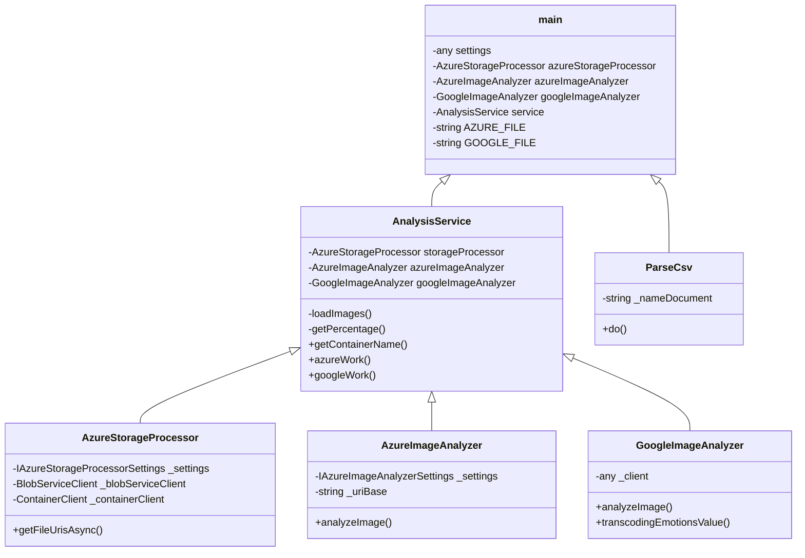

```mermaid
classDiagram
	main <|-- AnalysisService
	main <|-- ParseCsv
	main: -any settings
	main: -AzureStorageProcessor azureStorageProcessor
	main: -AzureImageAnalyzer azureImageAnalyzer
	main: -GoogleImageAnalyzer googleImageAnalyzer
	main: -AnalysisService service
	main: -string AZURE_FILE
	main: -string GOOGLE_FILE
	AnalysisService <|-- AzureStorageProcessor
	AnalysisService <|-- AzureImageAnalyzer
	AnalysisService <|-- GoogleImageAnalyzer
	AnalysisService: -AzureStorageProcessor storageProcessor
	AnalysisService: -AzureImageAnalyzer azureImageAnalyzer
	AnalysisService: -GoogleImageAnalyzer googleImageAnalyzer
	AnalysisService: -loadImages()
	AnalysisService: -getPercentage()
	AnalysisService: +getContainerName()
	AnalysisService: +azureWork()
	AnalysisService: +googleWork()
	class AzureImageAnalyzer{
		-IAzureImageAnalyzerSettings _settings
		-string _uriBase
		+analyzeImage()
	}
	class AzureStorageProcessor{
		-IAzureStorageProcessorSettings _settings 
		-BlobServiceClient _blobServiceClient 
		-ContainerClient _containerClient 
		+getFileUrisAsync()
	}
	class GoogleImageAnalyzer{
		-any _client
		+analyzeImage()
		+transcodingEmotionsValue()
	}
	class ParseCsv{
		-string _nameDocument
		+do()
	}		
```