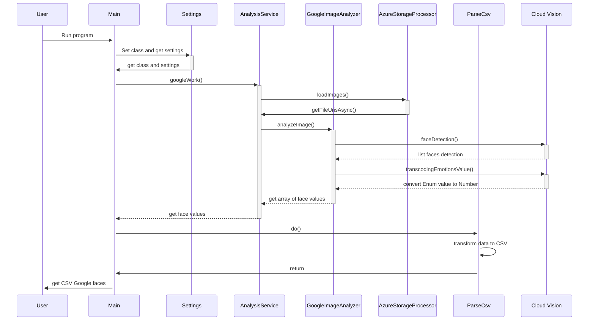

```mermaid
sequenceDiagram
    participant U as User
    participant M as Main
    participant S as Settings
    participant AS as AnalysisService
    participant GIA as GoogleImageAnalyzer
    participant ASP as AzureStorageProcessor
    participant PCSV as ParseCsv
    participant GOOGLE as Cloud Vision
	U->>+M: Run program						
	M->>+S: Set class and get settings 						
	S->>-M: get class and settings							
	M->>+AS: googleWork()						
	AS->>+ASP: loadImages()	
	ASP->>-AS: getFileUrisAsync()					
	AS->>+GIA: analyzeImage()					
	GIA->>+GOOGLE: faceDetection()					
	GOOGLE-->>-GIA: list faces detection	
    GIA->>+GOOGLE: transcodingEmotionsValue()					
	GOOGLE-->>-GIA: convert Enum value to Number					
	GIA-->>-AS: get array of face values			
	AS-->>-M: get face values
    M->>+PCSV: do()	
    PCSV->>+PCSV: transform data to CSV	
    PCSV->>+M: return	
    M->>+U: get CSV Google faces 	
```