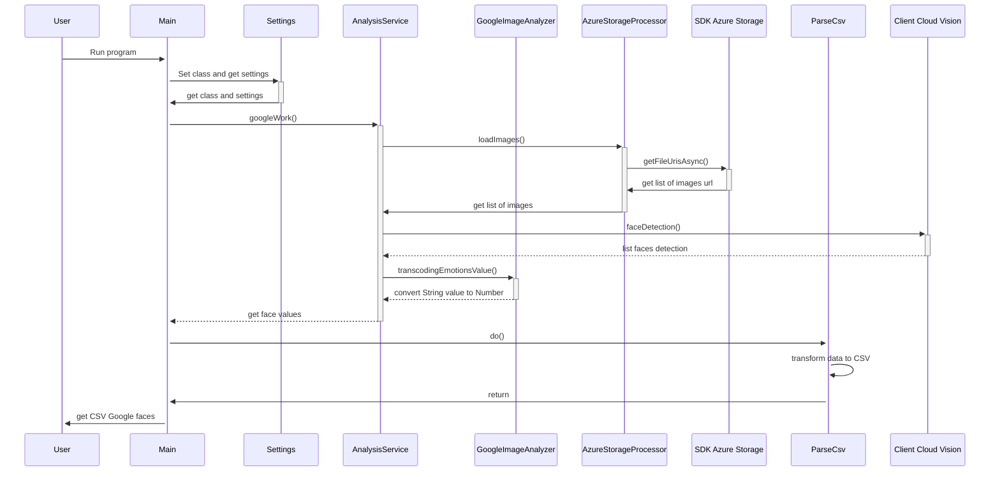

```mermaid
sequenceDiagram
    participant U as User
    participant M as Main
    participant S as Settings
    participant AS as AnalysisService
    participant GIA as GoogleImageAnalyzer
    participant ASP as AzureStorageProcessor
    participant SDKSTORAGE as SDK Azure Storage
    participant PCSV as ParseCsv
    participant GOOGLE as Client Cloud Vision
	U->>+M: Run program						
	M->>+S: Set class and get settings 						
	S->>-M: get class and settings							
	M->>+AS: googleWork()						
	AS->>+ASP: loadImages()	
	ASP->>+SDKSTORAGE: getFileUrisAsync()
    SDKSTORAGE->>-ASP: get list of images url
    ASP->>-AS: get list of images						
	AS->>+GOOGLE: faceDetection()			
	GOOGLE-->>-AS: list faces detection	
    AS->>+GIA: transcodingEmotionsValue()					
	GIA-->>-AS: convert String value to Number								
	AS-->>-M: get face values
    M->>+PCSV: do()	
    PCSV->>+PCSV: transform data to CSV	
    PCSV->>+M: return	
    M->>+U: get CSV Google faces	
```
