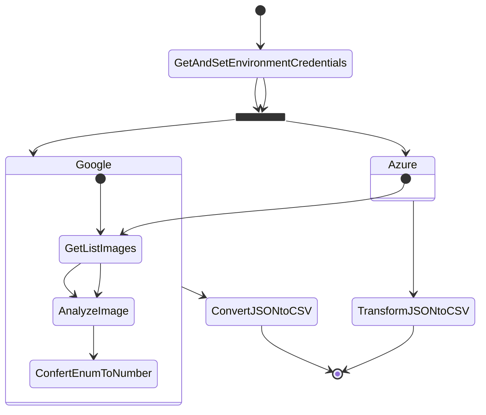

```mermaid
stateDiagram
    state fork_state <<fork>>
      [*] --> GetAndSetEnvironmentCredentials
      GetAndSetEnvironmentCredentials --> fork_state
      fork_state --> Azure
      state Azure {
            [*] --> GetListImages
            GetListImages --> AnalyzeImage
      }
      Azure --> TransformJSONtoCSV
      TransformJSONtoCSV --> [*]

      GetAndSetEnvironmentCredentials --> fork_state
      fork_state --> Google
      state Google {
            [*] --> GetListImages
            GetListImages --> AnalyzeImage
            AnalyzeImage --> ConfertEnumToNumber
      }
      Google --> ConvertJSONtoCSV
      ConvertJSONtoCSV --> [*]
```